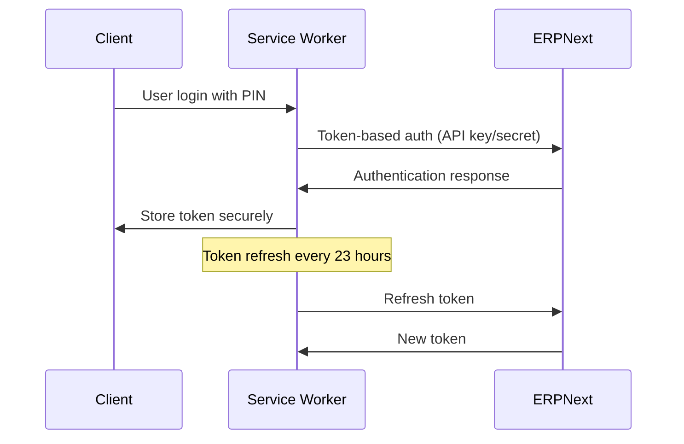

# Technical Architecture - POS PWA Retail System

## 1. System Architecture Overview

### Core Principles
- **Offline-First**: All POS operations work without internet connection
- **Performance**: <100ms scan-to-display, <200ms search response
- **Reliability**: Crash recovery, data integrity, audit trail
- **Security**: Role-based access, anti-fraud measures, audit logging

### Architecture Pattern
```
┌─────────────────┐    ┌──────────────────┐    ┌─────────────────┐
│   PWA Frontend  │    │  Local Storage   │    │  ERPNext API    │
│   (React/Vue)   │◄──►│   (IndexedDB)    │◄──►│   Integration   │
│                 │    │                  │    │                 │
│ - UI Components │    │ - Items Cache    │    │ - Master Data   │
│ - State Mgmt    │    │ - Pricing Rules  │    │ - Transactions  │
│ - Sync Engine   │    │ - Transaction Q  │    │ - Sync Status   │
│ - Audit Logger  │    │ - Audit Logs     │    │                 │
└─────────────────┘    └──────────────────┘    └─────────────────┘
```

## 2. Technology Stack

### 2.1 Frontend Framework
**Choice: React 18+ with TypeScript**

**Rationale:**
- Excellent PWA support with Create React App or Vite
- Strong ecosystem for IndexedDB (Dexie.js)
- High performance with React 18 concurrent features
- TypeScript for type safety in complex pricing logic
- Large developer community and resources

**Alternative Considered: Vue 3**
- Smaller bundle size
- Simpler learning curve
- Good PWA support
- **Rejected**: Smaller ecosystem for enterprise POS features

### 2.2 Build Tools & Development
**Primary: Vite + React + TypeScript**
- Fast development server with HMR
- Excellent TypeScript support
- Optimized production builds
- PWA plugin support

**Development Tools:**
- ESLint + Prettier for code quality
- Jest + React Testing Library for testing
- Cypress for E2E testing
- Workbox for PWA service workers

### 2.3 Local Storage Solution
**Choice: Dexie.js (IndexedDB Wrapper)**

**Rationale:**
- Promise-based API (easier than raw IndexedDB)
- Built-in versioning and migration support
- Excellent TypeScript definitions
- Active maintenance and large community
- Automatic indexing capabilities

**Database Schema Design:**
```typescript
// Dexie schema definition
interface POSDatabase extends DBSchema {
  items: {
    key: string; // SKU
    value: {
      sku: string;
      name: string;
      barcodes: string[];
      basePrice: number;
      branchActive: boolean;
      category: string;
      unit: string;
      updatedAt: Date;
    };
    indexes: {
      'by-barcode': string;
      'by-name': string;
      'by-category': string;
    };
  };
  pricingRules: {
    key: string; // rule ID
    value: {
      id: string;
      priority: number;
      conditions: PricingCondition[];
      discountType: 'percentage' | 'fixed' | 'free_item';
      discountValue: number;
      validFrom: Date;
      validTo: Date;
      applicableBranches: string[];
    };
    indexes: {
      'by-priority': number;
      'by-validity': [Date, Date];
    };
  };
  cartHold: {
    key: string; // basket ID
    value: {
      id: string;
      items: CartItem[];
      createdAt: Date;
      lastAccessed: Date;
    };
  };
  salesQueue: {
    key: string; // transaction ID
    value: {
      id: string;
      items: CartItem[];
      total: number;
      paymentMethod: PaymentBreakdown;
      branchId: string;
      cashierId: string;
      timestamp: Date;
      status: 'pending' | 'syncing' | 'completed' | 'failed';
      retryCount: number;
    };
    indexes: {
      'by-status': string;
      'by-timestamp': Date;
    };
  };
  auditLogs: {
    key: string; // log ID
    value: {
      id: string;
      action: string;
      userId: string;
      userRole: string;
      timestamp: Date;
      details: any;
      immutable: boolean;
    };
    indexes: {
      'by-timestamp': Date;
      'by-user': string;
      'by-action': string;
    };
  };
  syncStatus: {
    key: string; // sync ID
    value: {
      id: string;
      lastSyncTime: Date;
      pendingItems: number;
      lastError?: string;
    };
  };
}
```

### 2.4 State Management
**Choice: Zustand + React Query**

**Rationale:**
- **Zustand**: Lightweight, simple API, excellent TypeScript support
- **React Query**: Server state management, caching, background sync
- **Combined**: Local state + server state separation

**State Architecture:**
```typescript
// Zustand store for UI state
interface POSStore {
  currentCart: CartItem[];
  heldBaskets: Basket[];
  currentUser: User | null;
  isOnline: boolean;
  scannerActive: boolean;
  
  // Actions
  addItem: (item: CartItem) => void;
  removeItem: (index: number) => void;
  updateQuantity: (index: number, qty: number) => void;
  holdCurrentCart: () => void;
  recallBasket: (basketId: string) => void;
  processSale: (payment: PaymentBreakdown) => Promise<void>;
}

// React Query for server state
const useItemsQuery = useQuery({
  queryKey: ['items', branchId],
  queryFn: () => fetchItems(branchId),
  staleTime: 1000 * 60 * 30, // 30 minutes
  cacheTime: 1000 * 60 * 60, // 1 hour
});

const useSyncQueueMutation = useMutation({
  mutationFn: syncTransaction,
  onSuccess: () => queryClient.invalidateQueries(['sync-status']),
});
```

### 2.5 PWA Configuration

**Service Worker Strategy: Workbox**
```javascript
// workbox-config.js
module.exports = {
  globDirectory: 'dist/',
  globPatterns: [
    '**/*.{html,js,css,png,jpg,svg,webmanifest}'
  ],
  swDest: 'dist/sw.js',
  runtimeCaching: [
    {
      urlPattern: /^https:\/\/erp\.example\.com\/api\/.*/,
      handler: 'NetworkFirst',
      options: {
        cacheName: 'erp-api-cache',
        expiration: {
          maxEntries: 100,
          maxAgeSeconds: 60 * 60 * 24, // 24 hours
        },
      },
    },
  ],
};
```

**PWA Manifest:**
```json
{
  "name": "POS PWA Retail",
  "short_name": "POS",
  "description": "Offline-first POS system with ERPNext integration",
  "start_url": "/",
  "display": "standalone",
  "background_color": "#ffffff",
  "theme_color": "#000000",
  "orientation": "landscape",
  "icons": [
    {
      "src": "/icons/icon-192.png",
      "sizes": "192x192",
      "type": "image/png"
    }
  ]
}
```

## 3. Performance Optimization Strategy

### 3.1 Bundle Optimization
- **Code Splitting**: Route-based and feature-based splitting
- **Tree Shaking**: Remove unused code
- **Dynamic Imports**: Load pricing engine and heavy components on demand
- **Bundle Analysis**: webpack-bundle-analyzer to monitor size

### 3.2 Runtime Performance
- **Virtual Scrolling**: For large item lists (React Window)
- **Debounced Search**: 200ms delay for search input
- **Memoization**: React.memo for expensive components
- **Web Workers**: For complex pricing calculations

### 3.3 IndexedDB Optimization
- **Strategic Indexing**: Barcode, name, category indexes
- **Batch Operations**: Bulk inserts and updates
- **Compression**: Gzip for large datasets
- **Cleanup**: Automatic old transaction purging

## 4. Security Architecture

### 4.1 Authentication Flow


### 4.2 Data Security
- **Local Encryption**: Sensitive data encrypted in IndexedDB
- **API Security**: HTTPS only, token rotation
- **Audit Trail**: Immutable log entries
- **Role Validation**: Server-side permission checks

### 4.3 Anti-Fraud Measures
- **Device Binding**: Each device registered to specific branch
- **Transaction Integrity**: Digital signatures for offline transactions
- **Override Logging**: All price changes require PIN + reason
- **Duplicate Prevention**: Server-side idempotency checks

## 5. Development Environment Setup

### 5.1 Project Structure
```
pos-pwa/
├── public/
│   ├── icons/
│   ├── sw.js
│   └── manifest.json
├── src/
│   ├── components/
│   │   ├── common/
│   │   ├── pos/
│   │   └── auth/
│   ├── hooks/
│   ├── stores/
│   ├── services/
│   │   ├── database/
│   │   ├── erpnext/
│   │   └── sync/
│   ├── utils/
│   ├── types/
│   └── App.tsx
├── tests/
├── cypress/
└── docs/
```

### 5.2 Environment Configuration
```bash
# .env.development
REACT_APP_ERPNEXT_URL=https://erp.example.com
REACT_APP_API_VERSION=v2
REACT_APP_BRANCH_ID=default
REACT_APP_DEBUG=true

# .env.production
REACT_APP_ERPNEXT_URL=https://erp.yourcompany.com
REACT_APP_API_VERSION=v2
REACT_APP_BRANCH_ID=${BRANCH_ID}
REACT_APP_DEBUG=false
```

### 5.3 Development Scripts
```json
{
  "scripts": {
    "start": "vite",
    "build": "tsc && vite build",
    "test": "jest",
    "test:e2e": "cypress run",
    "lint": "eslint src --ext .ts,.tsx",
    "type-check": "tsc --noEmit",
    "pwa:analyze": "workbox wizard"
  }
}
```

## 6. Deployment Strategy

### 6.1 Build Process
1. **TypeScript Compilation**: Check types, generate JS
2. **Bundle Optimization**: Minification, compression
3. **PWA Generation**: Service worker, manifest injection
4. **Asset Optimization**: Image compression, font optimization

### 6.2 Distribution
- **Static Hosting**: Netlify, Vercel, or AWS S3 + CloudFront
- **CDN Distribution**: Global edge locations
- **Version Management**: Semantic versioning with rollback capability
- **A/B Testing**: Gradual rollout via CDN edge rules

### 6.3 Auto-Update Strategy
```javascript
// Service worker update logic
self.addEventListener('message', (event) => {
  if (event.data === 'SKIP_WAITING') {
    self.skipWaiting();
  }
});

// App update notification
const handleUpdate = () => {
  const updateAvailable = window.confirm(
    'New version available. Reload to update?'
  );
  if (updateAvailable) {
    window.location.reload();
  }
};
```

This technical architecture provides a solid foundation for building the POS PWA system that meets all the blueprint requirements while ensuring performance, security, and maintainability.